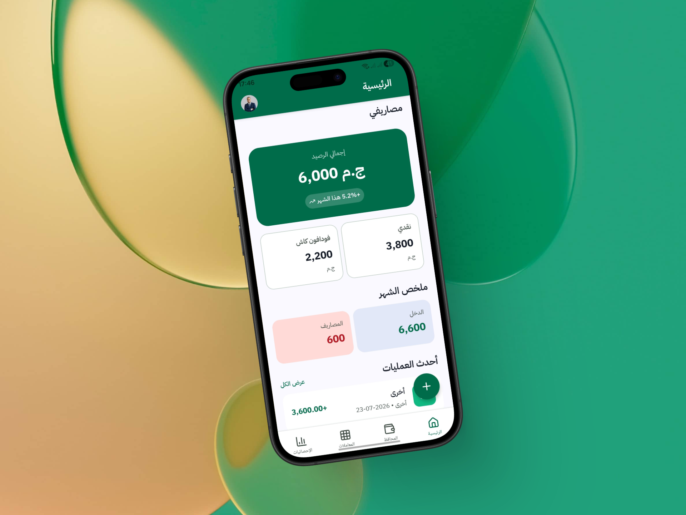
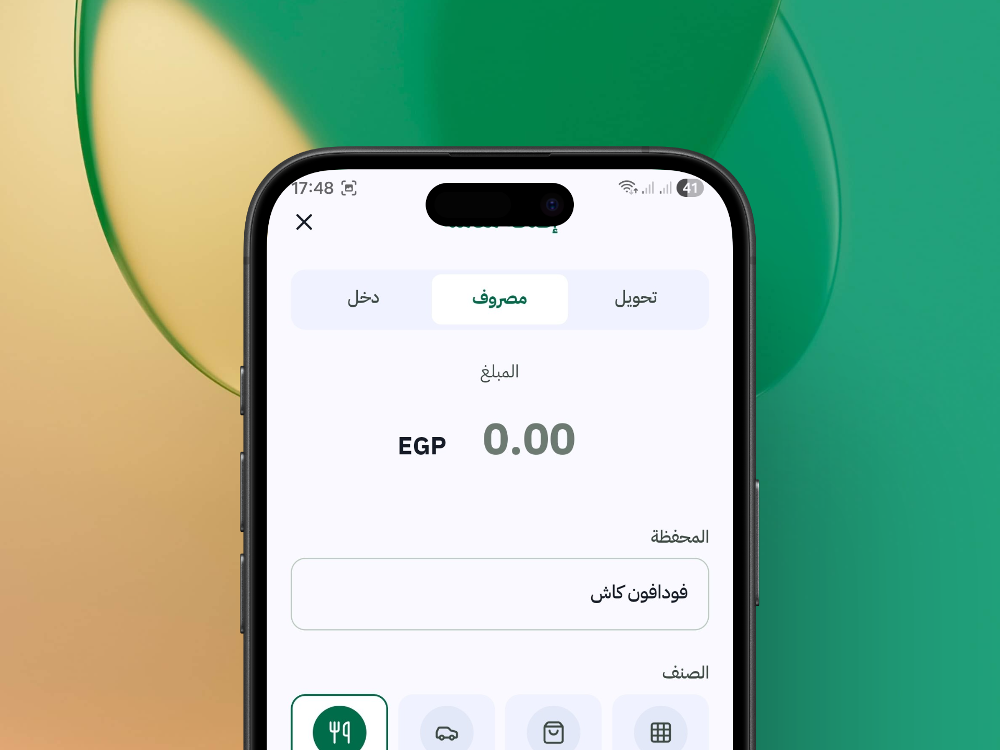
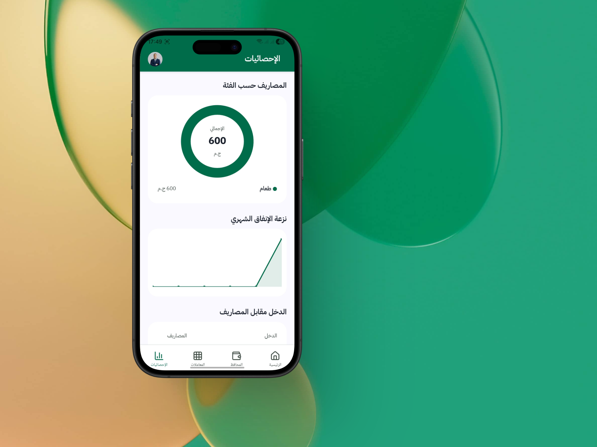
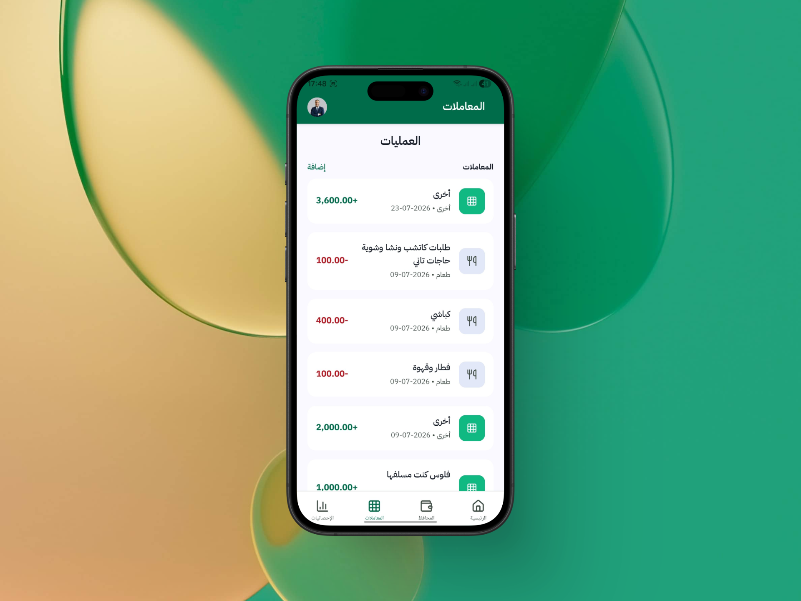

# Masari

<p align="center">
  
</p>

<p align="center">
  <strong>A modern mobile app built with Expo & React Native</strong>
</p>

---

## Preview

<p align="center">
  
  
</p>

<p align="center">
  
  
  
</p>

---

## Get Started

### 1. Install dependencies

```bash
npm install
```

### 2. Start the app

```bash
npx expo start
```

In the output, you'll find options to open the app in a:

- [Development build](https://docs.expo.dev/develop/development-builds/introduction/)
- [Android emulator](https://docs.expo.dev/workflow/android-studio-emulator/)
- [iOS simulator](https://docs.expo.dev/workflow/ios-simulator/)
- [Expo Go](https://expo.dev/go)

---

## Tech Stack

- [Expo](https://expo.dev)
- [React Native](https://reactnative.dev)
- [Expo Router](https://docs.expo.dev/router/introduction)

---

## Learn More

- [Expo Documentation](https://docs.expo.dev/)
- [Learn Expo Tutorial](https://docs.expo.dev/tutorial/introduction/)

---

## License

This project is licensed under the MIT License.
